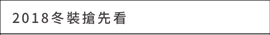
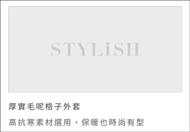
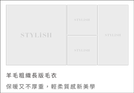

# Week 0 Part 1

## Before assignment

We are going to make our first page of STYLiSH. Here's the link of UI design:

[Home Page](https://zpl.io/bPXN91p)

## Assignment

We build the UI portion of this page first.

  <br><br>

Step 1. Establish `Toolbar` in activity not fragment, each page has the same toolbar.

Step 2. Establish `BottomNavigation` with `Jetpack Navigation` design.

Step 3. Establish `NavHostFragment` in activity and navigate to `HomeFragment`.

Step 4. Establish a `RecyclerView` by `ListAdapter` with 3 different `ViewHolders` (header and 2 different cells) in `HomeFragment`.

  <br><br>
  <br><br>
  <br><br>

 **Make sure I can see these different cells on the app screen.**

Step 5. You should use `noto_sans` (find it from fontFamily of Android Studio) instead of `NotoSansCJKtc` series as font in STYLiSH.

**Make sure your app fit the UI designs in Zeplin. You should take care of the colors, font, distance, etc...**

**You can find images and icon in `resources` folder under this repo.**

**Your app should work perfectly in all Android devices.**

## Hint

1. Toolbar
2. App Navigation
3. sealed class
```
sealed class DataItem {

    abstract val id: Long

    data class Title(val title: String) : DataItem() {
        override val id: Long = -1
    }
    data class FullProduct(val product: Product) : DataItem() {
        override val id: Long
            get() = product.id
    }
    data class CollageProduct(val product: Product) : DataItem() {
        override val id: Long
            get() = product.id
    }
}
```
4. getItemViewType
```
    override fun getItemViewType(position: Int): Int {
        return when (getItem(position)) {
            is DataItem.Title -> ITEM_VIEW_TYPE_TITLE
            is DataItem.FullProduct -> ITEM_VIEW_TYPE_PRODUCT_FULL
            is DataItem.CollageProduct -> ITEM_VIEW_TYPE_PRODUCT_COLLAGE
        }
    }

    private const val ITEM_VIEW_TYPE_TITLE = 0x00
    private const val ITEM_VIEW_TYPE_PRODUCT_FULL = 0x01
    private const val ITEM_VIEW_TYPE_PRODUCT_COLLAGE = 0x02
```
5. submitList with Mock Data
```
        val dataList = mutableListOf<DataItem>()

        val item1 = DataItem.Title()
        dataList.add(item1)

        val item2 = DataItem.FullProduct()
        dataList.add(item2)

        val item3 = DataItem.CollageProduct()
        dataList.add(item3)

        adapter.submitList(dataList)
```

## Note

1. You don't need to implement DrawerLayout, just place the icon on the upper left.
2. In this part, you don't have to set the cart quantity view yet.
